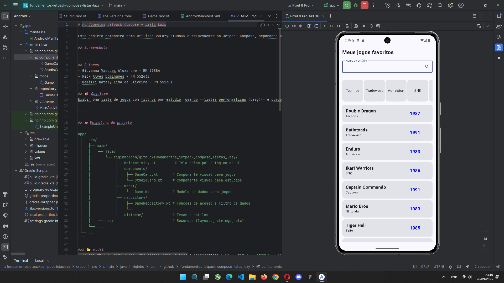
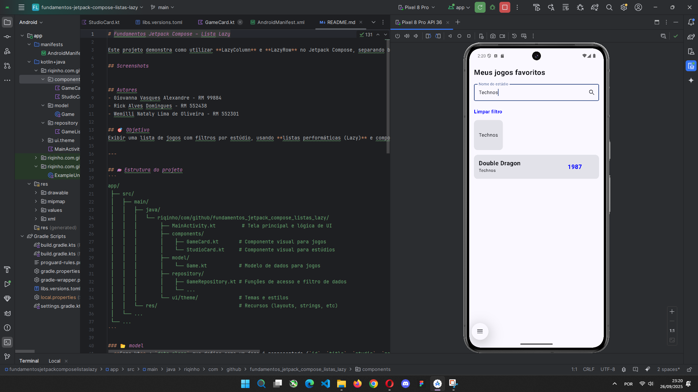

# Fundamentos Jetpack Compose – Lista Lazy

Este projeto demonstra como utilizar **LazyColumn** e **LazyRow** no Jetpack Compose, separando bem as responsabilidades entre **model**, **repository** e **components**.

## Screenshots



## Autores
- Giovanna Vasques Alexandre - RM 99884
- Rick Alves Domingues - RM 552438
- Wemilli Nataly Lima de Oliveira - RM 552301

## 🎯 Objetivo
Exibir uma lista de jogos com filtros por estúdio, usando **listas performáticas (Lazy)** e componentes reutilizáveis.

---

## 🗂 Estrutura do projeto
```
app/
 ├── src/
 │   ├── main/
 │   │   ├── java/
 │   │   │   └── riqinho/com/github/fundamentos_jetpack_compose_listas_lazy/
 │   │   │        ├── MainActivity.kt         # Tela principal e lógica de UI
 │   │   │        ├── components/
 │   │   │        │    ├── GameCard.kt       # Componente visual para jogos
 │   │   │        │    └── StudioCard.kt     # Componente visual para estúdios
 │   │   │        ├── model/
 │   │   │        │    └── Game.kt           # Modelo de dados para jogos
 │   │   │        ├── repository/
 │   │   │        │    ├── GameRepository.kt # Funções de acesso e filtro de dados
 │   │   │        │    └── ...
 │   │   │        └── ui/theme/              # Temas e estilos
 │   │   └── res/                            # Recursos (layouts, strings, etc)
 │   └── ...
 └── ...
```

### 📂 model
- **Game.kt** → `data class` que define como um jogo é representado (`id`, `title`, `studio`, `releaseYear`).  
  Serve de base para montar listas e passar os dados para os componentes.

### 📂 repository
- **Repository** → camada que fornece os dados.  
  - `getAllGames()` retorna uma lista fixa de jogos (mock).  
  - `getGamesByStudio(studio)` filtra os jogos pelo estúdio.  

💡 Em um app real, aqui poderia estar a conexão com banco de dados ou API.

### 📂 components
- **GameCard.kt** → Componente que representa **um item da lista de jogos**.  
  Mostra título, estúdio e ano dentro de um card. Usado na `LazyColumn`.  

- **StudioCard.kt** → Componente que representa **um botão de filtro** (chip) de estúdios.  
  Usado na `LazyRow`, muda de aparência quando está selecionado.

---

## 🖼️ Tela principal (MainActivity / GamesScreen)

### Estado e orquestração
- `searchTextState` → guarda o texto digitado no campo de busca.  
- `gamesListState` → controla a lista atual exibida (filtrada ou não).  

A tela reage às mudanças de estado e se recompõe automaticamente.

### Campo de busca
- Usa `OutlinedTextField` com um botão de lupa (`IconButton`).  
- Ao clicar, chama `getGamesByStudio(searchTextState)` e atualiza a lista.

### Limpar filtro
- Exibe um texto “**Limpar filtro**” quando há busca/filtro.  
- Ao clicar, volta para `getAllGames()`.

### LazyRow – filtros horizontais
```kotlin
LazyRow {
    items(gamesListState) { game ->
        StudioCard(
            game = game,
            onClick = {
                searchTextState = game.studio
                gamesListState = getGamesByStudio(game.studio)
            }
        )
    }
}
```
- Lista horizontal de estúdios.
- Ao clicar, aplica o filtro e atualiza a lista principal.

### LazyColumn - Lista de games
```Kotlin
LazyColumn {
    items(gamesListState) { game ->
        GameCard(game = game)
    }
}
```
- Lista vertical que exibe os jogos filtrados.
- Cada item é renderizado pelo componente GameCard, garantindo padronização visual.
- Usar LazyColumn é essencial porque ela só renderiza os itens visíveis na tela, tornando a lista muito mais performática.

